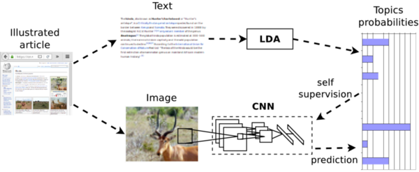

# TextTopicNet
**Self-supervised learning of visual features through embedding images into text topic spaces**, CVPR 2017.

L. Gomez*, Y. Patel*, M. Rusiñol, D. Karatzas, C.V. Jawahar.

In this paper we present a method that is able to take advantage of freely available multi-modal content to train computer vision algorithms without human supervision. We put forward the idea of performing self-supervised learning of visual features by mining a large scale corpus of multi-modal (text and image) documents. We show that discriminative visual features can be learnt efficiently by training a CNN to predict the semantic context in which a particular image is more probable to appear as an illustration. For this we leverage the hidden semantic structures discovered by a well-known topic modeling technique over the text corpus.



Our CNN learns to predict the semantic context in which images appear as illustration. Given an illustrated article we project its textual information into the topic-probability space provided by the LDA topic modeling framework. Then we use this semantic level representation as the supervisory signal for CNN training.

If you make use of the code in this repository for scientific purposes, we appreciate it if you cite our paper:

```
@inproceedings{gomez2017self,
  title={Self-supervised learning of visual features through embedding images into text topic spaces},
  author={Gomez, Lluis and Patel, Yash and Rusinol, Mar{\c{c}}al and Karatzas, Dimosthenis and Jawahar, CV},
  booktitle={Proceedings of the IEEE Conference on Computer Vision and Pattern Recognition},
  pages={4230--4239},
  year={2017}
}
```

## Pretrained models

[TextTopicNet_Wikipedia_ImageCLEF_40Topics.caffemodel](https://drive.google.com/open?id=0B52HmBFhEpdCTldNYjk5TnFTTDA)

[TextTopicNet_finetuned_VOC2007.caffemodel](https://drive.google.com/open?id=0B52HmBFhEpdCUElJVVZKU1FibTA)

## Training from scratch

### Set up data

Download and uncompress the **Wikipedia Retrieval 2010 Collection** and  **The PASCAL Visual Object Classes Challenge 2007** datasets into the ``data/ImageCLEF_Wikipedia/`` and ``data/VOC2007/`` folders respectively. Follow the specific instructions provided in:

[data/ImageCLEF_Wikipedia/README.md](data/ImageCLEF_Wikipedia/README.md)

[data/VOC2007/README.md](data/VOC2007/README.md)

### Learn LDA model

Run the following commands in order to process the data and learn the LDA model on the text corpus:

```
cd LDA
python generate_train_dict.py
python learn_LDA_model.py
python generate_train_labels.py
```

This will generate the LDA model files (``ldamodel40.lda`` and ``ldamodel40.lda.state``) that can be used to project new texts into the learned topic space; and a file ``training_labels40.json`` with the trainig labels (topic space probabilities) for all images in our training dataset. If you want to skip this step and directly train the CNN model you can download the files from the following links: [ldamodel40.lda](https://drive.google.com/open?id=0B52HmBFhEpdCZUM1MXNoR1h3RFU) / [ldamodel40.lda.state](https://drive.google.com/open?id=0B52HmBFhEpdCWDV6SXZGaDlYcWs) / [dictionary.dict](https://drive.google.com/open?id=0B52HmBFhEpdCTVJKa3hnS3VRVkE) / [training_labels40.json](https://drive.google.com/open?id=0B52HmBFhEpdCTDZTSDFMVWswNEU)

### Train CNNs

Run the following commands to train the CaffeNet model from scratch:

```
cd CNN/CaffeNet
export PYTHONPATH=./:$PYTHONPATH
caffe train --solver solver.prototxt
```

Once trained, the CNN model can be used for image classification in two different ways:
* as a feature extractor, i.e. extract features from late layers (e.g. fc7, fc6, pool5, etc.) and training an SVM classifier.
* finetuning the weights for a classification task, e.g. using the PASCAL VOC 2007 training data.

The same model can be used for the following multi-modal retrieval tasks:
* Image query vs. Text database: First projecting all text documents into the topic space using the learned LDA model. And then projecting the image query into the topic space using the CNN model, and find the nearest neighbour texts on the database.
* Text query vs. Image database: same as before but the other way around.


### Experiments

The scripts in the ``experiments/`` folder reproduce the results of the experiments in our paper.
* Run the script ``experiments/multi_modal_retrieval.py``  for multi-modal retrieval experiment on Wikipedia dataset.
* Run the script ``experiments/voc_2007_classification.py`` for image classification experiment on PASCAL VOC 2007.
